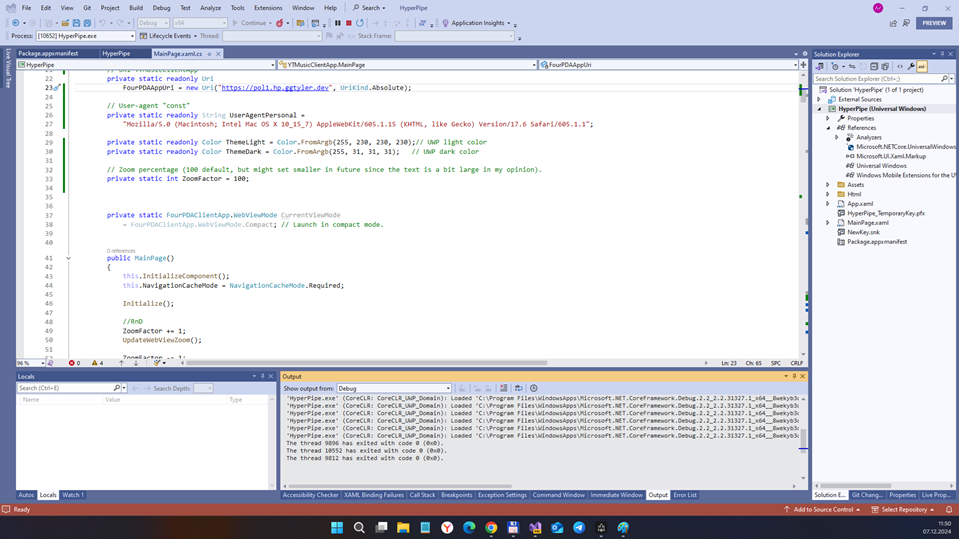
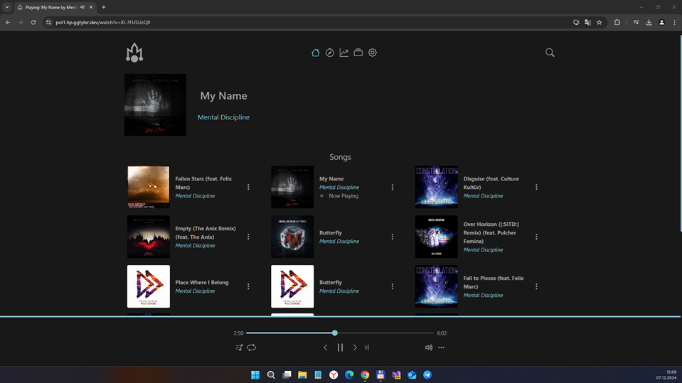

# HyperPipe - main branch

100%-based on handy & useful [WebWhatsApp](https://github.com/jetspiking/WindowsPhone_WebWhatsApp) repo.

## About
Experimental UWP application (aka PWA) to display "HyperPipe YT Music" web site on "winphone" with Windows 10 Desktop. Damaged (old EDGE blocked / not supported?)

## Screenshots

## Tech/dev details
- Platforms: UWP
- Targets: x64
- OSes: Windows 11 (os build: 16299 or above)

## Status
- Draft. Prototype / Alpha version.
- "Web parsing" not realized yet ... so, no push notifications, etc.
- Not operational / operable... something went wrong! :(

## Credits / Thanks
- [jetspiking](https://github.com/jetspiking) for very 
  handy & useful [WebWhatsApp](https://github.com/jetspiking/WindowsPhone_WebWhatsApp) repo!
- https://pol1.hp.ggtyler.dev One of "Hyperpipe YT Music" back-ends (not blocked in Russia)
- https://mariushosting.com/how-to-install-hyperpipe-on-your-synology-nas/ How to Install Hyperpipe on Your Synology NAS
- https://alternativeto.net/software/youtube-music/ The Best YouTube Music Alternatives

## Licensing
MIT License

## ..
AS IS. No support. RnD only / DIY

## .
[m][e] December, 7 2024
